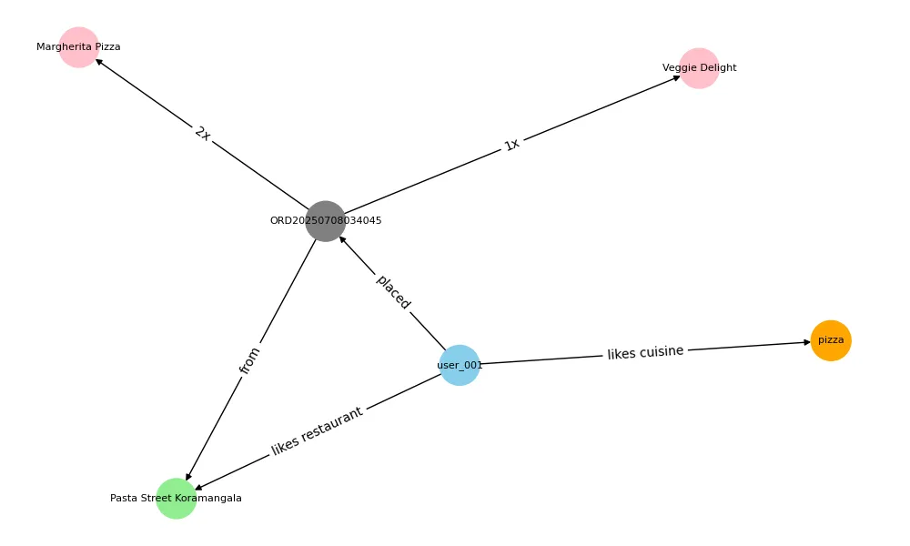

# ğŸ½ï¸ FoodBot — AI-powered Food Ordering Assistant - Raise Hackathon - Prosus Track

[](https://huggingface.co/spaces/Ashwath-Shetty/food-ordering-bot)

> **Try it live**: [https://huggingface.co/spaces/Ashwath-Shetty/food-ordering-bot](https://huggingface.co/spaces/Ashwath-Shetty/food-ordering-bot)

---

## ✨ Overview

**FoodBot** is an intelligent, interactive chatbot that helps users order food effortlessly. It takes a user's location and food preference, searches for the best nearby restaurants using **SerpAPI**, and responds with restaurant suggestions using **LLM-powered tools**.

This project is designed using **LangChain agents**, orchestrated to provide modular, clean, and explainable AI behavior. It was built as part of a **Raise hackathon & Prosus track**.

---

## 🤖 Features

* 🔠**Location Normalization** using LLM
* 🌟 **Top Restaurant Search** using Google Maps via SerpAPI
* 🤠**Agent Orchestration** with LangChain
* 🔄 **In-memory Knowledge Graph** to remember users
* 🨠**Gradio UI** for fast prototyping and deployment
* âš¡ **Groq API** + **LLaMA 3** for fast, low-latency inference


---

### 📠Project Structure

```
raise_hackathon_prosus_track/
│
├── app.py                         # Entry point to launch the Gradio interface
├── agent.py                       # Defines the main FoodOrderingAgent using LangChain
├── prompts.py                     # Contains prompt templates and API keys
├── tools.py                       # Custom LangChain Tools (location normalization, restaurant search, etc.)
├── utils.py                       # Utility functions (normalization, rendering graphs, etc.)
├── models.py                      # Data models using @dataclass (Restaurant, MenuItem, etc.)
│
├── assets/
│   └── image.webp                 # (Optional) Architecture or agent flow image for README
│
├── notebooks/                     # Jupyter notebooks for experiments (cleaned before push)
│
├── requirements.txt               # Package list for pip-based installation
├── pyproject.toml                 # Poetry configuration
├── README.md                      # Project documentation (you're reading it!)
```

---


## 📊 Architecture

### Agent Design

The core agent is a `FoodOrderingAgent` built with LangChain's ReAct paradigm and powered by:

* **LLM (Groq + LLaMA3)**: For location understanding, reasoning
* **Tools:**

  * `LocationNormalizerTool`
  * `RestaurantSearchTool`
  * `MenuTool` 


### Modular Components

* `agent.py` — Orchestration logic
* `tools.py` — LangChain tools (wrappers over SerpAPI, Groq)
* `prompts.py` — API setup and shared clients
* `models.py` — Dataclasses for restaurants, menus, users
* `utils.py` — Support functions and graph renderer
* `app.py` — Gradio chatbot app launcher

---

## 🌠Live Demo

Launch the chatbot here:
**🔗 [https://huggingface.co/spaces/Ashwath-Shetty/food-ordering-bot](https://huggingface.co/spaces/Ashwath-Shetty/food-ordering-bot)**

---

## 🚀 Quickstart

### Option 1: Using Poetry (Recommended)

#### 1. Clone the repository

```bash
git clone https://github.com/your-username/raise_hackathon_prosus_track.git
cd raise_hackathon_prosus_track
```

#### 2. Install with Poetry

```bash
poetry env use python3.10
poetry install
poetry shell
```

#### 3. Setup environment variables

Create a `.env` file:

```env
GROQ_API_KEY=your_groq_api_key
SERP_API_KEY=your_serp_api_key
```

Or export directly:

```bash
export GROQ_API_KEY=your_groq_api_key
export SERP_API_KEY=your_serp_api_key
```

#### 4. Run the chatbot

```bash
python app.py
```

### Option 2: Using pip

#### 1. Install dependencies

```bash
pip install -r requirements.txt
```

#### 2. Set API keys (same as above)

#### 3. Run the app

```bash
python app.py
```

---

## 💼 Requirements

### Poetry (preferred)

```toml
[tool.poetry.dependencies]
python = "3.10"
gradio = "5.35.0"
groq = "0.29.0"
httpx = "0.28.1"
langchain = "0.3.26"
langchain_groq = "0.3.5"
matplotlib = "3.10.3"
networkx = "3.4.2"
Pillow = "11.3.0"
pydantic = "2.11.7"
requests = "2.32.4"
```

### `requirements.txt`

```
gradio==5.35.0
groq==0.29.0
httpx==0.28.1
langchain==0.3.26
langchain_groq==0.3.5
matplotlib==3.10.3
networkx==3.4.2
Pillow==11.3.0
pydantic==2.11.7
requests==2.32.4
```

---

## 🌠Deploying to Hugging Face Spaces

1. **Add `README.md` metadata** at the top of the file (already done).
2. **Add `.huggingface.yaml`** (optional for advanced settings)
3. **Set secrets**:

   * Go to **Space Settings > Secrets**
   * Add:

     ```
     GROQ_API_KEY=your_groq_api_key
     SERP_API_KEY=your_serp_api_key
     ```
4. **Ensure `requirements.txt` is correct and versions are pinned**
5. **Push to Hugging Face**

```bash
git remote add space https://huggingface.co/spaces/Ashwath-Shetty/food-ordering-bot
git push space main
```

---

## 💰 API Usage Notes

### Groq API (LLM)

* Fast inference with LLaMA3-8B
* Used for natural language prompts like location understanding

### SerpAPI (Google Maps)

* Required for real-time restaurant discovery
* **Free tier gives 100 searches/month - this is a bottle neck & we might exhaust the api limit soon**. if you see chatbot is failing to respond after giving location info, it's probably because we hit the api limit, if you're testing multiple times try to test using the same location & food type - e.x: location - MG road Bengaluru, food - pizza.

---

## 🤠Sample Conversation

```plaintext
👤: hi
🤖: Hello! Welcome to our food ordering service!  I'm here to help you find and order delicious food. What's your location so I can find restaurants near you?

👤: i'm near jyothi nivas koramangala
🤖: Great! I've set your location to Koramangala, Bengaluru, India. What type of food are you craving today? (e.g., pizza, burgers, sushi, etc.)

👤: pizza
🤖: ğŸ½ï¸ Top 3 restaurants found for 'pizza' in Koramangala, Bengaluru, India:

    Si Nonna's - The Original Sourdough Pizza - Koramangala, Bengaluru
    📠Ground Floor, Evantha Praha, No.64, Koramangala, Bengaluru, Karnataka 560034, India
    🴠pizza
    â­â­â­â­ (4.8/5)
    Pizza Hut | Koramangla, Bangalore
    📠487, 80 Feet Rd, opposite to BATA Shoes, 6th Block, Koramangala, Bengaluru, Karnataka 560095, India
    🴠pizza
    â­â­â­â­ (4.6/5)
    Pasta Street Koramangala
    📠Ground floor, 751, 80 Feet Rd, 4th Block, Koramangala, Bengaluru, Karnataka 560034, India
    🴠pizza
    â­â­â­â­ (4.4/5)
    Which restaurant would you like to order from? Just tell me the name or number.

👤: pasta street
🤖: Excellent choice! Here's the menu for Pasta Street Koramangala:

ğŸ½ï¸ Menu for Pasta Street Koramangala:

📂 Appetizer
   • Focaccia Frenzy - $6.99
     Freshly baked focaccia served with garlic butter and herbs.

   • Bruschetta Bliss - $8.99
     Toasted baguette topped with diced tomatoes, basil, and mozzarella, drizzled with balsamic glaze.

 📂 Main Course
   • Margherita Pizza - $12.99
     Classic tomato, mozzarella, and basil on sourdough crust.

   • Quattro Formaggi - $14.99
     Four-cheese pizza with mozzarella, parmesan, gorgonzola, and ricotta, served with a side of garlic bread.

   • Meat Lover's Masterpiece - $16.99
     Loaded pizza with pepperoni, sausage, bacon, and ham, topped with mozzarella and served with a side of garlic bread.

👤: add 1 Veggie Delight, 2 Margherita Pizza 
🤖: 🛒 Added to cart:
    - 1 x Veggie Delight
    - 2 x Margherita Pizza

    🛒 Your Cart (Pasta Street Koramangala):
    - 1x Veggie Delight: $15.99
    - 2x Margherita Pizza: $25.98

    💰 Total: $41.97

    Would you like to add more or checkout?

👤: checkout
🤖: Perfect! Here's your order summary:

    🛒 Your Cart (Pasta Street Koramangala):
    - 1x Veggie Delight: $15.99
    - 2x Margherita Pizza: $25.98

    💰 Total: $41.97

    Would you like to confirm this order? (yes/no)

👤: yes
🤖: 🉠Order confirmed! Your order #ORD20250708034045 has been placed successfully.

    Delivery time: 30-45 minutes
    Restaurant: Pasta Street Koramangala
    Total: $41.97

    Thank you for your order! You'll receive updates via SMS.


```
**click on show knowledge graph to see the knowledge graph** 


---

## 📊 Architecture
---

### 🧭 Conversation Flow Diagram
```txt
[ Start: User sends a message ]
               |
               v
     ┌────────────────────────────â”
     | Check Current Conversation |
     |         State              |
     └────────────┬──────────────┘
                  |
        ┌─────────┴──────────â”
        â–¼                    â–¼
 [ Greeting / New User ]     [ Existing State ]
        |                            |
        â–¼                            â–¼
[ Greet user → Ask for location ]   [ Continue based on state ]
        |
        â–¼
[ Normalize Location using Tool ]
        |
        â–¼
[ Ask for food preference/cuisine ]
        |
        â–¼
[ Use RestaurantSearchTool to show 3 options ]
        |
        â–¼
[ User selects restaurant by name or number ]
        |
        â–¼
[ Use MenuTool to generate menu via LLM ]
        |
        â–¼
[ Show menu → User adds items (LLM parses it) ]
        |
        â–¼
[ Update cart → Show cart summary ]
        |
        â–¼
   ┌────────────────────────────â”
   | Check if user says:        |
   | "show cart", "checkout"    |
   └────────────┬──────────────┘
                |
           ┌────┴────â”
           â–¼         â–¼
   [ Show cart ]   [ Continue ]
                     |
                     â–¼
             [ Confirm order? ]
                     |
               ┌─────┴──────â”
               â–¼            â–¼
            [ Yes ]       [ No ]
               |            |
               â–¼            â–¼
 [ Place order → Save to KG ]  [ Reset state or return to menu ]
               |
               â–¼
      [ Thank user → Reset state ]
```

---

### 🤖 Agent Orchestration Diagram

```txt
                            ┌────────────────────â”
                            │    User Input      │
                            └────────┬───────────┘
                                     │
                                     â–¼
                     ┌─────────────────────────────â”
                     │  FoodOrderingAgent (Main)   │
                     └────────┬────────────┬───────┘
                              │            │
                              │            ▼
                              │     ┌────────────â”
                              │     │ Conversation│
                              │     │    State    │
                              │     └────────────┘
                              │            │
      ┌───────────────────────┘            ▼
      â–¼
┌─────────────────────────────────────────────────────────────────────────â”
│     Agent interprets input and determines which action to take          │
└─────────────────────────────────────────────────────────────────────────┘
                              │
     ┌────────────────────────────────────────────────────────────────â”
     │      Depending on state, invoke appropriate TOOL or LLM call   │
     └────────────────────────────────────────────────────────────────┘
                              │
        ┌─────────────┬──────────────┬──────────────â”
        â–¼             â–¼              â–¼              â–¼
┌────────────┠┌────────────────┠┌─────────────┠┌────────────────â”
│Location    │ │Restaurant      │ │MenuTool     │ │Cart Extraction │
│Normalizer  │ │SearchTool      │ │(LLM Menu)   │ │Prompt (LLM)    │
└────────────┘ └────────────────┘ └─────────────┘ └────────────────┘
        │             │              │              │
        └─────────────┴────┬─────────┴──────────────┘
                          â–¼
              ┌───────────────────────────â”
              │     Intermediate Output   │
              │ (e.g., menu, restaurants) │
              └─────────────┬─────────────┘
                            â–¼
                 ┌─────────────────────â”
                 │ Update Agent State  │
                 └─────────────────────┘
                            â–¼
            ┌────────────────────────────────â”
            │ Store to Knowledge Graph       │
            │ (preferences, order history)   │
            └────────────────────────────────┘
                            â–¼
                   ┌─────────────────â”
                   │  Agent Responds │
                   │  to User        │
                   └─────────────────┘
                            │
                            â–¼
                     ┌──────────────â”
                     │ Chat Memory  │ ◄─── stores dialogue context (last 10 turns)
                     └──────────────┘
```

---

### ğŸ› ï¸ Tool Descriptions

| Tool Name                  | Purpose                                                               | Input Format                                | Output Format                                           |
| -------------------------- | --------------------------------------------------------------------- | ------------------------------------------- | ------------------------------------------------------- |
| **LocationNormalizerTool(LLM)** | Normalize user’s text input location (e.g., "near Jyothi Nivas")  uses LLM to understand the location and get the coordinates    | `user_message: str`                         | `{ "location": "Koramangala, Bengaluru", "ll": "..." }` |
| **RestaurantSearchTool**   | Fetch top 3 restaurants using SerpAPI (Google Maps)                   | `location: str`, `food_type: str`           | Formatted string or JSON of top restaurants             |
| **MenuTool**               |  menu for selected restaurant                  | `restaurant_name: str`, `cuisine_type: str` | `formatted_menu: str`, `structured_items: JSON`         |
| **Cart Extraction (LLM)**  | Extract items and quantities from natural text (user says “2 pizzasâ€), helpful for cart update, menu lookup etc. | Prompt includes `menu` + `user message`     | `[{"item": "Pizza", "quantity": 2}]`                    |
| **Knowledge Graph**        | Store and query user’s preferences and order history                  | Accessed via user\_id                       | JSON-like structure with past orders & locations        |

---

## 🔠Troubleshooting

* **`OSError: Cannot find empty port`**

  * Solution: On Hugging Face, don’t use `server_port`. Use `demo.launch(server_name="0.0.0.0")`


* **API key not set**

  * Ensure `.env` exists or variables are exported before running

---

## 💠Acknowledgments

* [Groq](https://groq.com/) — blazing fast LLM inference
* [LangChain](https://www.langchain.com/) — modular agent orchestration
* [Gradio](https://www.gradio.app/) — quick LLM UIs
* [SerpAPI](https://serpapi.com/) — restaurant and location data

---

## 📖 License

MIT License. See `LICENSE` file.

---

## 🚀 What's Next?

Here are some exciting directions and improvements planned for the project:

* **Integrate Order Confirmation via WhatsApp (Twilio)**
  Add a mock payment flow and integrate Twilio to send WhatsApp messages for order confirmations, making the user experience feel more realistic and complete.

* **Improve Menu Retrieval System**
  This remains the hardest challenge. Neither SerpAPI nor Tavily provide structured menu data. Web scraping for menus is inconsistent and time-consuming—especially difficult to implement reliably within the short span of a 4-day hackathon. Exploring OCR + image menus or structured data from restaurant websites could be future solutions.

* **Smoother Natural Language Conversations**
  Enhance the fluidity and realism of user-bot interactions. This involves refining the prompt structure, memory context, fallback handling, and introducing intent classification to better interpret diverse inputs.

* **Enable True Asynchronous Execution**
  Currently, the app uses synchronous API and LLM calls. Adopting full `async/await` support will improve performance, especially during multi-step reasoning with external API calls and chained agent workflows.

* **Multi Modal input**
   Support providing i/p in Voice, Images etc.

* **Smarter Knowledge Graph with Personalized Context**
  The Knowledge Graph currently tracks user preferences (like cuisine types and favorite restaurants) and location, stored in-memory. In future versions, we plan to:

  * **Persist the graph** to a database or local file for long-term user history.
  * **Use prior visit data** to tailor conversations—e.g., “Would you like to reorder from Chianti Pizza?â€
  * **Incorporate context over sessions**, so the bot remembers repeat users or recommends based on past behavior.

  **Current Challenges**:

  * The in-memory implementation resets between sessions (especially on stateless platforms like Hugging Face Spaces).
  * Maintaining a light, queryable, and LLM-friendly representation of graph data without overengineering.
  * Balancing memory vs. personalization without leaking information across users in shared deployments.

---

## 🔧 How to Extend This Solution to Other Services

The current architecture of **FoodBot** is modular and agent-driven, making it easy to expand into other real-world domains using the same principles of:

* **Agent orchestration**
* **LLM-based reasoning**
* **Tool abstraction**
* **Stateful conversations**

Below are examples of how to reuse and extend this system to support **Travel Booking** and **Product Marketplace** use cases.

---

### 🧳 1. Travel Booking Assistant

#### 🯠Use Case

Allow users to:

* Search for flights and hotels
* Plan itineraries
* Book travel arrangements

#### 💡 Flow Breakdown

1. **Greeting**
2. **Ask for travel type**: flight, hotel, or full itinerary
3. **Collect necessary details**: dates, destinations, number of travelers
4. **Use travel APIs** (like Skyscanner, Amadeus) to search flights/hotels
5. **Present top options**
6. **Add to travel itinerary/cart**
7. **Confirm & book**
8. **Store preferences (destinations, airlines, budgets)** in the Knowledge Graph

#### 🔧 Tools to Add

* `FlightSearchTool`: Integrates with flight APIs
* `HotelSearchTool`: For hotel options based on destination and dates
* `ItineraryPlannerTool`: LLM + rule-based trip planner
* `TravelBookingTool`: Final booking or summary

---

### ğŸ›ï¸ 2. Product Marketplace Assistant

#### 🯠Use Case

Support buying and selling of new or second-hand products.

#### 💡 Flow Breakdown

1. **Greeting**
2. **Ask if user wants to Buy or Sell**
3. **For Buying:**

   * Ask for category (electronics, books, clothing)
   * Ask for filters (price range, condition, location)
   * Search using APIs (Flipkart, OLX, Amazon)
4. **For Selling:**

   * Collect product name, condition, price, and location
   * Generate a draft listing via LLM
   * Ask for confirmation
5. **Summarize cart/listing**
6. **Confirm or restart**

#### 🔧 Tools to Add

* `ProductSearchTool`: Scrape or call APIs to search for products
* `ListingBuilderTool`: For LLM-based generation of seller posts
* `MarketplaceAPITool`: Integration layer to interact with platforms like OLX or Flipkart

---

### 🔄 3. Shared Orchestration Strategy (Multi-Agent Router)

To manage multiple services like **food**, **travel**, and **marketplace**, a central **router agent** can classify the user’s intent and forward the request to the appropriate domain agent.

---

#### 📌 Intent Routing Logic

```txt
User Message
     |
     â–¼
[ Intent Classifier ]
     |
 ┌───┴────────────┬────────────â”
 â–¼                â–¼            â–¼
FoodOrdering    Travel       Marketplace
   Agent         Agent          Agent
```

```python
def route_intent(user_input: str) -> str:
    user_input = user_input.lower()
    if any(word in user_input for word in ["flight", "hotel", "travel", "trip", "itinerary"]):
        return "travel"
    elif any(word in user_input for word in ["buy", "sell", "product", "item", "market"]):
        return "marketplace"
    else:
        return "food"
```

---

#### 🧠 Unified Multi-Agent Launcher

```python
intent = route_intent(user_message)

if intent == "food":
    response = food_ordering_agent.run(user_message)
elif intent == "travel":
    response = travel_booking_agent.run(user_message)
elif intent == "marketplace":
    response = marketplace_agent.run(user_message)
```


---

### 📦 Knowledge Sharing Across Domains

All domain agents share:

* 🔠**Conversation Memory** – lets the assistant reference recent steps, across all services
* 🧠 **Knowledge Graph** – stores structured user data like:

  * preferred cuisines or restaurants (FoodBot)
  * favorite travel destinations or airlines (TravelBot)
  * product preferences or sell history (MarketplaceBot)

This enables **cross-domain intelligence**, like:

> “Would you like to rebook your last trip to Goa and also reorder that Margherita Pizza from Pasta Street?â€

---

### 🧩 Modular Agent Structure

Each new service uses a similar modular structure:

```
agent/
  ├── food_agent.py
  ├── travel_agent.py
  └── marketplace_agent.py

tools/
  ├── location_tool.py
  ├── restaurant_search_tool.py
  ├── flight_search_tool.py
  ├── product_search_tool.py
  └── etc...
```

You only need to:

* Plug in service-specific tools
* Add state transitions for that service
* Reuse memory, conversation, and KG logic

---

### ✅ Benefits of This Design

| Advantage                | Description                                                              |
| ------------------------ | ------------------------------------------------------------------------ |
| 🧠 Centralized Reasoning | Core logic (LLM prompts, memory) is shared across all agents             |
| 🧩 Plug-and-play Tools   | Easy to register tools like `FlightSearchTool`, `ProductSearchTool`, etc |
| 📈 Scalable              | Add more domains (e.g., tutoring, finance) by registering new agents     |
| 🧠 Context Awareness     | Cross-service suggestions and memory retention                           |
| 🧪 Fast Prototyping      | Each agent can be tested and deployed independently                      |

---

## checkout our team

* [raise hackathon team](https://lablab.ai/event/raise-your-hack/just-do-it-prosus-track)

---

